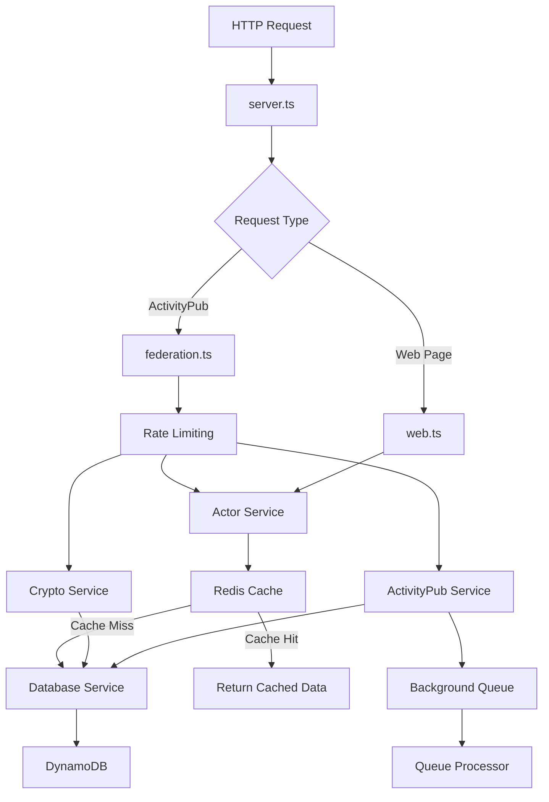

# ImageOn Backend - Refactored Architecture 🏗️

## 📁 Project Structure

```
backend/
├── src/
│   ├── config/
│   │   ├── index.ts              # Main configuration & environment variables
│   │   └── redis.ts              # Redis configuration & instance creation
│   ├── services/
│   │   ├── database.ts           # DynamoDB operations & queries
│   │   ├── cryptography.ts       # Key management & crypto operations
│   │   ├── activitypub.ts        # ActivityPub protocol operations (with caching)
│   │   ├── redis.ts              # Redis caching, rate limiting & queuing
│   │   └── queue.ts              # Background job processing
│   ├── models/
│   │   └── Actor.ts              # Actor data model & business logic (with caching)
│   ├── handlers/
│   │   ├── federation.ts         # Fedify dispatchers & activity handlers (with rate limiting)
│   │   └── web.ts                # HTTP request handlers (home, health)
│   └── server.ts                 # Main server entry point (with Redis KvStore)
├── scripts/                      # Development scripts
├── test-*.mjs                    # Test files
├── demo-redis.js                 # Redis integration demonstration
├── REDIS_INTEGRATION.md          # Redis integration documentation
├── .env                          # Environment configuration
└── package.json                  # Dependencies & scripts
```

## 🔧 **Separation of Concerns**

### **1. Configuration Layer** (`src/config/`)
- **Purpose**: Centralized configuration management
- **Responsibility**: Environment variables, server settings, federation config, Redis setup
- **Components**:
  - `index.ts`: Main application configuration
  - `redis.ts`: Redis connection configuration and instance creation
- **Benefits**: Single source of truth, easy environment switching, shared Redis configuration

### **2. Service Layer** (`src/services/`)
- **Purpose**: Core business logic and external integrations
- **Components**:
  - `database.ts`: DynamoDB operations, queries, data persistence
  - `cryptography.ts`: Key generation, storage, retrieval
  - `activitypub.ts`: ActivityPub protocol operations, relationship management (with Redis caching)
  - `redis.ts`: Application-level caching, rate limiting, and queuing
  - `queue.ts`: Background job processing for federation delivery

### **3. Model Layer** (`src/models/`)
- **Purpose**: Data models and domain logic
- **Components**:
  - `Actor.ts`: Actor entity, data transformation, validation (with Redis caching integration)

### **4. Handler Layer** (`src/handlers/`)
- **Purpose**: Request processing and response generation
- **Components**:
  - `federation.ts`: ActivityPub dispatchers (Actor, KeyPairs, Activities) with rate limiting
  - `web.ts`: HTTP request handlers (home page, health check)

### **5. Server Layer** (`src/server.ts`)
- **Purpose**: Application bootstrap and request routing
- **Responsibility**: Server startup, Fedify KvStore configuration with Redis, request delegation

## 🎯 **Benefits of This Architecture**

### **Performance**
- ✅ **Redis caching**: Dramatic performance improvements for repeated requests
- ✅ **Background processing**: Non-blocking federation delivery
- ✅ **Smart cache TTLs**: Optimized for different data types
- ✅ **Rate limiting**: Protection against abuse and resource exhaustion

### **Scalability**
- ✅ **Redis KvStore**: Fedify operations scale across multiple instances
- ✅ **Shared caching**: Multiple servers can share Redis instance
- ✅ **Queue system**: Asynchronous processing prevents bottlenecks
- ✅ **Database optimization**: Reduced DynamoDB queries through caching

### **Maintainability**
- ✅ Clear separation of concerns
- ✅ Single responsibility principle
- ✅ Easy to locate and modify specific functionality
- ✅ Comprehensive logging for debugging

### **Testability**
- ✅ Services can be unit tested independently
- ✅ Handlers can be tested with mocked services
- ✅ Clear dependencies make mocking easier
- ✅ Redis operations are abstracted and testable

### **Reliability**
- ✅ **Graceful degradation**: System works even if Redis is temporarily unavailable
- ✅ **Error handling**: Comprehensive error handling with logging
- ✅ **Delivery tracking**: Monitor federation success/failure
- ✅ **Connection resilience**: Automatic Redis reconnection

## 🚀 **How It Works**

### **Request Flow**


### **Data Flow**
1. **Request arrives** at `server.ts` with Fedify Redis KvStore
2. **Rate limiting** checks request frequency per IP
3. **Router determines** handler type (federation vs web)
4. **Handler processes** request using cached services
5. **Cache layer** checks Redis before database queries
6. **Services interact** with database/external APIs only on cache miss
7. **Background jobs** queued for asynchronous processing
8. **Response generated** and cached for future requests

### **ActivityPub Flow with Caching**
1. **Actor Request**: `federation.ts` → Rate Limit → `Actor.ts` → Redis Cache → `database.ts`
2. **Key Management**: `federation.ts` → `cryptography.ts` → Redis Cache → `database.ts`
3. **Follow Activity**: `federation.ts` → `activitypub.ts` → Background Queue → `database.ts`
4. **Activity Delivery**: Background Queue → `queue.ts` → Remote Server (async)

### **Caching Strategy**
- **Actors**: 1 hour TTL (relatively stable data)
- **Activities**: 15 minutes TTL (more dynamic content)
- **Cryptographic Keys**: 24 hours TTL (very stable)
- **Delivery Status**: 24 hours TTL (monitoring/debugging)
- **Rate Limits**: 1 hour TTL (abuse prevention)

## 📋 **Usage Examples**

### **Starting the Server**
```bash
npm run dev          # Development with hot reload
npm start           # Production mode

# Redis management
npm run redis:start  # Start Redis server (Docker)
npm run redis:stop   # Stop Redis server
npm run redis:logs   # View Redis logs
```

### **Testing Endpoints**
```bash
# Health check
curl http://localhost:3000/health

# Actor profile (triggers caching)
curl -H "Accept: application/activity+json" http://localhost:3000/users/alice

# Actor outbox (triggers activity caching)
curl -H "Accept: application/activity+json" http://localhost:3000/users/alice/outbox

# Home page
curl http://localhost:3000

# Redis demonstration
npx tsx demo-redis.js
```

### **Performance Testing**
```bash
# Test cache performance (first request = cache miss)
curl -H "Accept: application/activity+json" http://localhost:3000/users/alice

# Second request = cache hit (much faster)
curl -H "Accept: application/activity+json" http://localhost:3000/users/alice

# Monitor server logs to see:
# 🔍 Cache miss for actor: alice, fetching from database
# 🟢 Cache hit for actor: alice
```

### **Adding New Features**
1. **New ActivityPub Activity**: Add handler in `federation.ts`, background processing in `queue.ts`
2. **New API Endpoint**: Add handler in `web.ts`, add caching if needed
3. **New Database Operation**: Add method in `database.ts`, add caching in `redis.ts`
4. **New Background Job**: Add job type in `queue.ts`, implement processing logic
5. **New Cache Strategy**: Add methods in `redis.ts`, integrate in services

### **Performance Optimization**
1. **Monitor cache hit rates** through server logs
2. **Adjust TTL values** based on usage patterns
3. **Add new cache layers** for frequently accessed data
4. **Optimize queue processing** for high-volume federation
5. **Scale Redis** with clustering for production loads

## 🎨 **Technology Stack & Features**

### **Core Technologies**
- ✅ **TypeScript** for type safety and better developer experience
- ✅ **ES Modules** for modern JavaScript module system
- ✅ **Fedify** for ActivityPub federation with Redis KvStore
- ✅ **DynamoDB** for scalable NoSQL data persistence
- ✅ **Redis** for caching, rate limiting, and background queues

### **Performance Features**
- ✅ **Multi-layer caching** (Fedify KvStore + Application cache)
- ✅ **Smart cache TTLs** optimized for different data types
- ✅ **Background job processing** for non-blocking operations
- ✅ **Rate limiting** for abuse prevention
- ✅ **Connection pooling** and retry logic

### **Development Features**
- ✅ **Async/Await** for clean asynchronous code
- ✅ **Comprehensive error handling** with try/catch blocks
- ✅ **Structured logging** for debugging and monitoring
- ✅ **Environment-based configuration** for different deployments
- ✅ **Hot reload development** with tsx watch mode

### **Production Features**
- ✅ **Graceful degradation** when Redis is unavailable
- ✅ **Health check endpoints** for monitoring
- ✅ **Delivery status tracking** for federation debugging
- ✅ **Queue statistics** for operational visibility
- ✅ **Docker support** for Redis deployment

## 📊 **Performance Metrics**

### **Observed Improvements**
- 🚀 **Cache hits eliminate database queries** entirely
- ⚡ **Sub-millisecond response times** for cached data
- 🛡️ **Rate limiting protects** against abuse (100 requests/hour per IP for actors)
- 🔄 **Background processing** prevents blocking on federation delivery
- 📈 **Scalable architecture** ready for multiple server instances

### **Monitoring & Debugging**
```bash
# Server logs show performance metrics:
🟢 Cache hit for actor: alice          # Fast response
🔍 Cache miss for actor: bob           # Database query needed
💾 Cached actor: bob                   # Future requests will be fast
📤 Outbox request (remaining: 47)      # Rate limiting in action
➕ Added job to federation queue       # Background processing
```

This architecture provides a **production-ready, high-performance ActivityPub federation server** with intelligent caching, rate limiting, and asynchronous processing! 🌐✨
